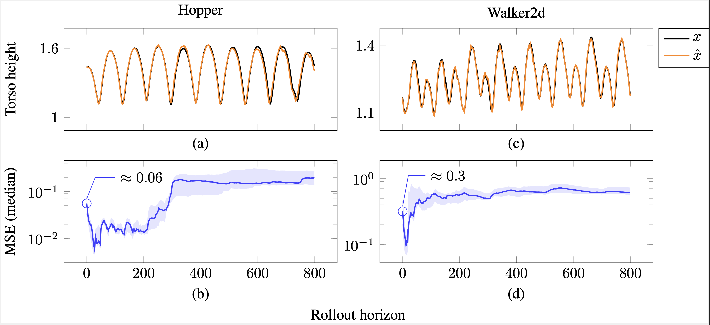
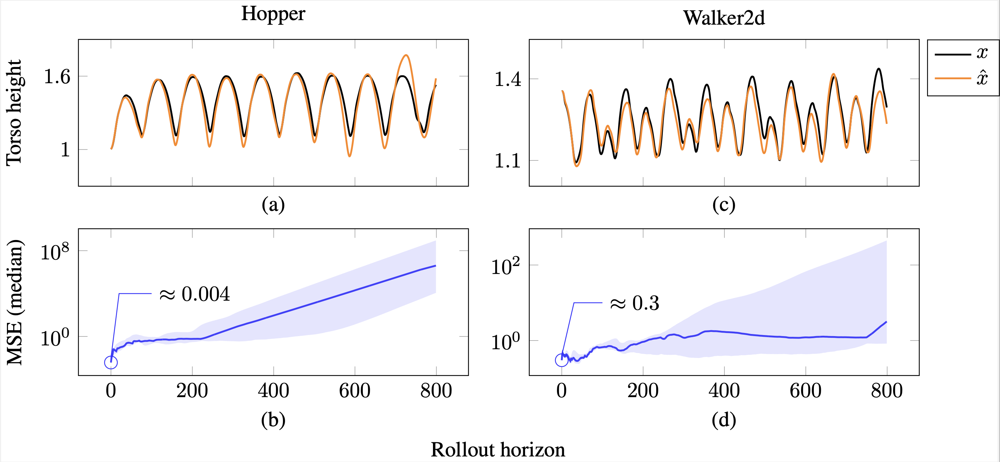

# Kalman-Inspired Neural Decomposition (KIND)

A hybrid dynamics modeling framework for stable long-horizon prediction under recursive rollout.

## Motivation

Learned dynamics models often achieve low one-step prediction error but fail under recursive application, leading to rollout drift and instability.

KIND addresses this by enforcing structural stability through an uncertainty-triggered decomposition into:
- a contractive nominal model
- a bounded excursion model

This enables consistent long-horizon predictions even in contact-rich systems.

## Repository Contents

This repository contains experiments spanning classical control, nonlinear systems, and learned dynamics, reflecting the evolution of the KIND framework across domains.

More specifically, the repository includes:

- PyTorch implementation of KIND
- Example notebooks for:
  - Kalman filter experiments (IFAC 2026, accepted)
  - Duffing oscillator experiments (CDC 2026, under review)
  - MuJoCo locomotion experiments (ongoing work)

## Quick Start

Jupyter notebooks are provided in an 'executed' state, so one could start browsing them immediately.

## Results

Preliminary results on MuJoCo tasks (Hopper, Walker2d) indicate that KIND can achieve:

- Stable rollouts up to 800 steps  
- Near-constant MSE over long horizons  
- Robust behavior across random seeds  

<figure>
  
  <figcaption>
  KIND rollout behavior. Predictions closely track ground truth over long horizons, with MSE remaining nearly constant across rollout steps (median with 10–90% quantiles).
  </figcaption>
</figure>

In contrast, standard baselines (global models, ensembles, mixture-of-experts) often exhibit:

- Rapid error growth under recursive rollout  
- High sensitivity to training initialization  
- Occasional divergence  

<figure>
  
  <figcaption>
  Ensemble rollout behavior. While some seeds yield stable trajectories, aggregated results show increasing error and significant variability across runs.
  </figcaption>
</figure>

These results highlight the gap between one-step accuracy and long-horizon stability, and suggest the importance of structural constraints in learned dynamics.

## Citation

If you use this code, please cite:

```
@inproceedings{Maalberg_2026_kind,
  title        = {{KIND}: A {K}alman-inspired Adaptive Estimator for {SRF} Cavity Detuning},
  author       = {Maalberg, Andrei and Neumann, Axel and Echevarria, Pablo and Ushakov, Andriy and Knobloch, Jens},
  booktitle    = {Proc. 23rd IFAC World Congr.},
  note         = {accepted},
  year         = {2026},
}
```

## Status

This repository is under active development. Additional environments (e.g., Ant, Humanoid) and experiments will be added.